  

> **CLASSIFIED OPERATION:** VOLATILE MEMORY FORENSICS & ARTIFACT EXTRACTION  
> **STATUS:** CONCLUDED | **AUTHOR:** MR. CIPHER-X [C|THE]

 

### 🛡️ Operation Abstract

This repository documents an advanced Digital Forensics and Incident Response (DFIR) operation focused on volatile memory (RAM) analysis. Utilizing the **Volatility Framework**, the objective was to parse memory dumps to uncover fileless malware, identify process hollowing (DLL injection), and extract hidden cryptographic keys and C2 artifacts that evade traditional disk-based detection.

---

### ⚙️ Forensic Architecture (Volatility Data Flow)

```mermaid
graph TD;
    A[Acquired Memory Dump .raw/.mem] -->|Volatility Framework| B(Image Identification);
    B --> C{Forensic Plugin Execution};
    C -->|pslist / psscan / psxview| D[Process Tree Analysis];
    C -->|netscan / connscan| E[Network Artifact Extraction];
    C -->|malfind / hollowfind| F[Memory Injection Detection];
    D -->|Hidden/Unlinked Process| G[Identify Rootkit Behavior];
    E -->|Active Port in RAM| H[Uncover Stealth C2];
    F -->|VAD Segment Extraction| I[Dump Injected Payload];
    G --> J[Compile Forensic Timeline & IOCs];
    H --> J;
    I --> J;
    
    style A fill:#1a1a1a,stroke:#00FFFF,stroke-width:2px;
    style J fill:#1a1a1a,stroke:#8A2BE2,stroke-width:2px;
```

---

### 🦠 Threat & Mitigation Matrix

| **Threat Vector** | **Indicators of Compromise (IOCs)** | **Forensic Technique / Plugin** | **Tactical Mitigation / Response** |
| :--- | :--- | :--- | :--- |
| **DKOM (Direct Kernel Object Manipulation)** | Process visible in `psscan` but hidden in `pslist` | Volatility: `psxview` | Isolate endpoint, identify rootkit driver, initiate bare-metal wipe. |
| **Process Hollowing (Injection)** | `PAGE_EXECUTE_READWRITE` permissions in VAD nodes | Volatility: `malfind` | Dump memory segment (`procdump`/`memdump`), reverse engineer payload. |
| **Fileless C2 Beaconing** | Lingering TCP connections associated with terminated PIDs | Volatility: `netscan` | Extract remote IPs, update network boundary blacklists. |

---

### 📸 Digital Evidence Board

*(Note: Raw memory dumps are classified. The following evidence represents parsed plugin outputs and extracted strings.)*

  <!-- NOTE: REPLACE THESE SRC LINKS WITH YOUR ACTUAL GITHUB IMAGE PATHS -->
  
  &nbsp; &nbsp;

---

  <code>[ OPERATION TERMINATED - MEMORY ARTIFACTS SECURED ]</code>

